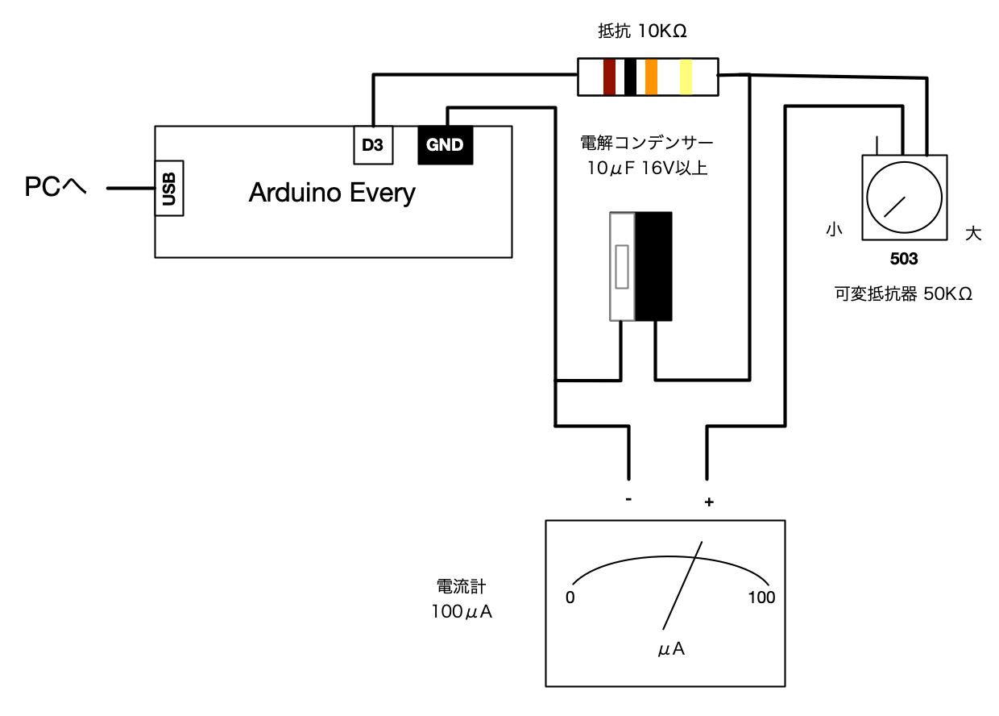

# CPU負荷アナログメータ Arduino版

* PC負荷メータのArduino Every版です。Arduino UNOでも使えるとおもいます。
* PWM出力を使います。
* LED、7セグ機能はありません。
* [ホスト側のソフトウェアはAVR版と同じものが使えます](../host)。

# 使い方

* Arduino IDEを使って[meter.ino](meter/meter.ino)を書き込んで下さい。
* [Arduino Everyの初期設定の方法はこちら](https://www.arduino.cc/en/Guide/NANOEvery)

# 回路図

