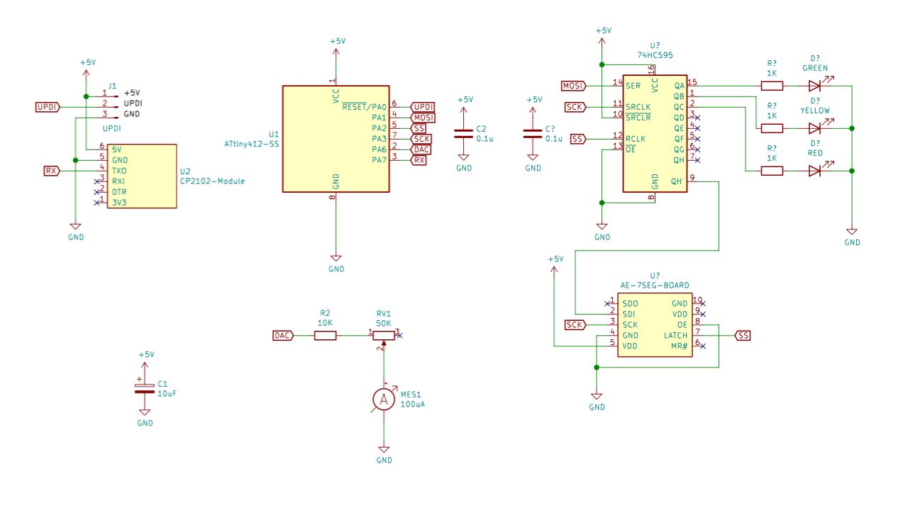

# ハードウェア

* microchip ATtiny412(tinyAVR1)
* ビルド環境はmacOS Catalina
* 開発環境は[こちら](https://github.com/mamemomonga/avr-toolchain-installer)
* 書込機は[jtag2updi](https://github.com/ElTangas/jtag2updi)

# ビルド

	$ make

# インストール

MakefileにあるPROGRAMMER で設定しているavrdudeの-Pで指定しているポートを環境に合わせて書き換えて下さい。

	$ make install

# 回路図

	

